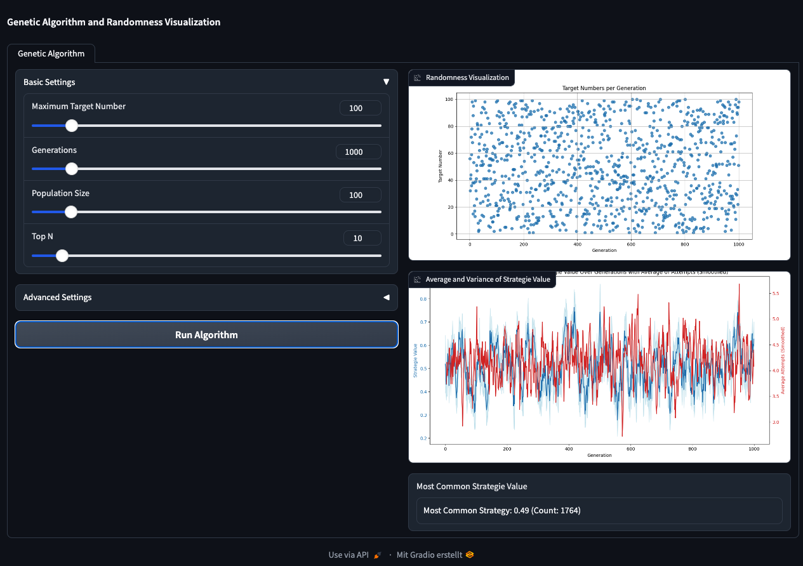

# Genetic Algorithm Visualization Tool

This project, `find_best_strategy.py`, is a Genetic Algorithm Visualization Tool designed to simulate and visualize the evolution of strategies in a genetic algorithm. The tool uses a simple genetic algorithm to evolve strategies for guessing a target number within a specified range. It provides insights into how strategies evolve over generations, the impact of mutation, and the randomness involved in the selection process.



## What are Genetic Algorithms?

Genetic Algorithms (GAs) are a family of computational models inspired by natural evolution. These algorithms encode a potential solution to a specific problem on a simple chromosome-like data structure and apply recombination and mutation operators to these structures so as to preserve critical information. Genetic algorithms are excellent for searching through large and complex spaces, as they can find solutions to problems that are difficult to solve using traditional methods. They are widely used in various fields, including optimization, machine learning, and artificial intelligence.

For more detailed information, visit [Genetic Algorithms on Wikipedia](https://en.wikipedia.org/wiki/Genetic_algorithm).

## Features

- **Genetic Algorithm Simulation**: Simulate the evolution of strategies over multiple generations.
- **Strategy Evaluation**: Evaluate strategies based on their ability to guess a target number.
- **Visualization**: Visualize the average and variance of strategy values and the randomness in target number selection.
- **Gradio Interface**: Interactive web interf
## Installation

Before running the project, ensure you have Python installed on your system. Then, install the required dependencies:

```bash
pip install -r requirements.txt
```

Note: The project requires additional modules for plotting (`plot_average_variation`, `plot_randomness`). Ensure these are correctly implemented and accessible in your project directory.

## Usage

To run the tool, execute the `find_best_strategy.py` script. This will launch a Gradio web interface where you can interact with the genetic algorithm:
```bash
    python find_best_strategy.py
```
In the interface, you can adjust various parameters such as:

- Maximum Target Number
- Number of Generations
- Population Size
- Top N Strategies
- Mutation Rate
- Mutation Step Values
- Initial Strategy Value Range

After setting the desired parameters, click "Run Algorithm" to start the simulation. The results will be displayed in the form of plots and text outputs.

## Components

- `Strategy`: A class representing a strategy with a value.
- `initialize_population`: Function to initialize a population of strategies.
- `generate_new_population`: Function to generate a new population from the top strategies.
- `evaluate_strategy`: Function to evaluate a strategy's performance.
- `select_top_strategies`: Function to select the top-performing strategies.
- `maintain_population_diversity`: Function to maintain diversity in the population.
- `bucketize_stragie_value`: Function to categorize strategy values.
- `run_algorithm`: Core function to run the genetic algorithm simulation.
- `main`: Entry point to launch the Gradio interface.

## Contributing

Contributions to this project are welcome! Whether it's improving the algorithm, enhancing the visualization, or fixing bugs, your input is valuable. Please feel free to fork the repository, make changes, and submit a pull request.

## License

This project is open-source and available under the MIT License.